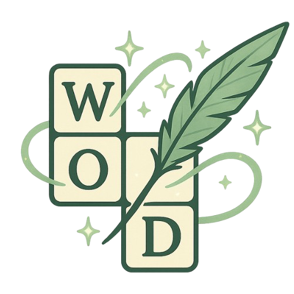

# WordWeaver
**WordWeaver** is an interactive, quiz-powered crossword game that blends wordplay with general knowledge. Designed with both entertainment and cognitive stimulation in mind, this web app dynamically builds crossword puzzles from quiz APIs, letting user test their knowledge while weavuing answers across a responsive grid.

This project exists to:
  - Provide a unique and educational twist on traditional crossword puzzles.
  - Offer a dynamic, category-based quiz game experience that adapts to user preferences.
  - Explore creative, interactive frontend development using HTML, CSS, JavaScript, and third-party APIs.

**Target Audience**:
  - Quiz enthusiasts who enjoy trivia-style challenges.
  - Puzzle lovers looking for a new way to engage with crosswords.
  - Users of all ages who want a fun and educational browser-based game.

By combining trivai with crosswords, WordWeaver engages users in a mentally reqarding experience that is equally suited for casual entertainment and light learning.

<!-- TODO: Insert final mockup screenshot here -->

## Table of Contents
- [User Goals](#user-goals)
- [User Stories](#user-stories)
- [Website Goals and Objectives](#website-goals-and-objectives)
- [Wireframes](#wireframes)
- [Design Choices](#design-chioces)
  - [Typography](#typography)
  - [Colour Scheme](#colour-scheme)
  - [Images](#images)
  - [Responsiveness](#responsiveness)
- [Features](#features)
  - [Existing Features](#existing-features)
  - [Future Enhancements](#future-enhancements)
  - [Stretch Goals](#stretch-goals)
- [Technologies Used](#technologies-used)
  - [Languages](#languages)
  - [Libraries and Frameworks](#libraries-and-frameworks)
  - [Tools](#tools)
- [Testing](#testing)
  - [Bugs Fixed](#bugs-fixed)
  - [Responsiveness Tests](#responsiveness-tests)
  - [Code Validation](#code-validation)
    - [HTML](#html)
    - [CSS](#css)
    - [JavaScript](#javascript)
  - [User Story Testing](#user-story-testing)
  - [Feature Testing](#feature-testing)
  - [Accessibility Testing](#accessibility-testing)
  - [Lighthouse Testing](#lighthouse-testing)
  - [Browser Testing](#browser-testing)
- [Deployment](#deployment)
  - [To Delploy the Project](#to-delploy-the-project)
  - [To Fork the Project](#to-fork-the-project)
  - [To Clone the project](#to-clone-the-project)
- [Credits](#credits)

## User Goals
The following goals were identified to ensure WordWeaver offers meaningful value to its users:

  - Choose *categories* that match their interests or knowledge areas.
  - Solve fun and challenging crossword puzzles.
  - Engage with trivia-based questions across varying levels of difficulty.
  - Test and expand their general knowledge.
  - Access puzzles without needing to sign up or log in.
  - Experience smooth gameplay with intuitive navigation.
  - Enjoy a visually clean and responsive interface across devices.

## User Stories
- As a user, I want to choose the category of questions so that the crossword reflects my interests.
- As a user, I want to select the puzzle difficulty so I can play at my level.
- As a user, I want to play without needing to sign up or log in.
- As a user, I want to see clues displayed beside or beneath the crossword puzzle so I know how to solve it.
- As a user, I want to be able to input letters into the crossword grid so I can solve the puzzle.
- As a user, I the puzzle grid to adapt t the length of the answers so that every quiz feels custom-built.
- As a user, I want to be notified when I've correctly completed the puzzle so I know I've solved it.

User stories and development tasks are fully detailed on the [GitHub Project Board](https://github.com/users/creatvie-introvert/projects/13/views/1), showcasing steps taken to bring the project to completion.

## Website Goals and Objectives

## Wireframes

## Design Choices

### Typography

### Colour Scheme

### Images

### Responsiveness

## Features

### Existing Features

### Future Enhancements

### Stretch Goals

## Technologies Used

### Languages

### Libraries and Frameworks

### Tools

## Testing

### Bugs Fixed

### Responsiveness Tests

### Code Validation

#### HTML

#### CSS

#### JavaScript

### User Story Testing

### Feature Testing

### Accessibility Testing

### Lighthouse Testing

### Browser Testing

## Deployment

### To Delploy the Project

### To Fork the Project

### To Clone the project

## Credits