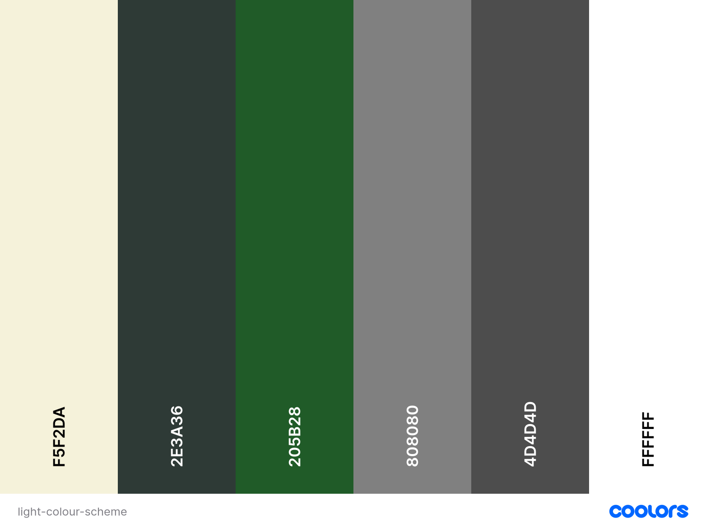
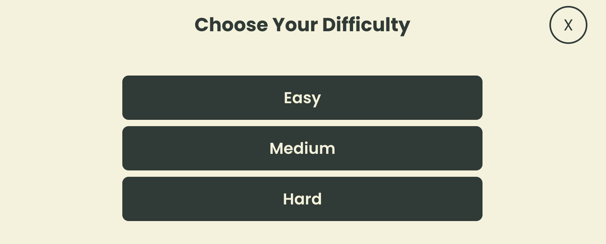
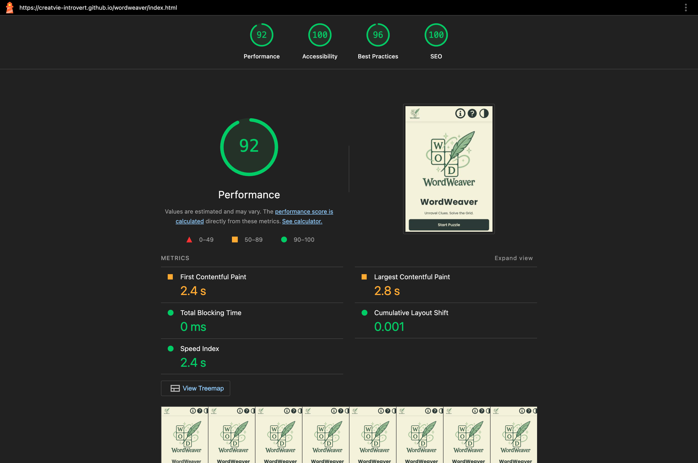

# WordWeaver
**WordWeaver** is an interactive, quiz-powered crossword game that blends wordplay with general knowledge. Designed with both entertainment and cognitive stimulation in mind, this web app dynamically builds crossword puzzles from quiz APIs, letting user test their knowledge while weaving answers across a responsive grid.

This project exists to:
  - Provide a unique and educational twist on traditional crossword puzzles.
  - Offer a dynamic, category-based quiz game experience that adapts to user preferences.
  - Explore creative, interactive frontend development using HTML, CSS, JavaScript, and third-party APIs.

**Target Audience**:
  - Quiz enthusiasts who enjoy trivia-style challenges.
  - Puzzle lovers looking for a new way to engage with crosswords.
  - Users of all ages who want a fun and educational browser-based game.

By combining trivia with crosswords, WordWeaver engages users in a mentally challenging experience that is equally suited for casual entertainment and light learning.


## Table of Contents
- [User Goals](#user-goals)
- [User Stories](#user-stories)
- [Website Goals and Objectives](#website-goals-and-objectives)
- [Wireframes](#wireframes)
- [Design Choices](#design-chioces)
  - [Typography](#typography)
  - [Colour Scheme](#colour-scheme)
  - [Images](#images)
  - [Responsiveness](#responsiveness)
- [Features](#features)
  - [Existing Features](#existing-features)
  - [Future Enhancements](#future-enhancements)
  - [Stretch Goals](#stretch-goals)
- [Technologies Used](#technologies-used)
  - [Languages](#languages)
  - [Libraries and Frameworks](#libraries-and-frameworks)
  - [Tools](#tools)
  - [Image and Asset Tools](#image-and-asset-tools)
  - [API](#api)
  - [Validation and Accessibilty Testing](#validation-and-accessibilty-testing)
  - [Responsive Design Testing](#responsive-design-testing)
  - [Deployment](#deployment)
- [Testing](#testing)
  - [Bugs Fixed](#bugs)
  - [Responsiveness Tests](#responsiveness-tests)
  - [Code Validation](#code-validation)
    - [HTML](#html)
    - [CSS](#css)
    - [JavaScript](#javascript)
  - [User Story Testing](#user-story-testing)
  - [Feature Testing](#feature-testing)
  - [Accessibility Testing](#accessibility-testing)
  - [Lighthouse Testing](#lighthouse-testing)
  - [Browser Testing](#browser-testing)
- [Deployment](#deployment)
  - [To Delploy the Project](#to-delploy-the-project)
  - [To Fork the Project](#to-fork-the-project)
  - [To Clone the project](#to-clone-the-project)
- [Credits](#credits)

## User Goals
The following goals were identified to ensure WordWeaver offers meaningful value to its users:

  - Choose *categories* that match their interests or knowledge areas.
  - Solve fun and challenging crossword puzzles.
  - Engage with trivia-based questions across varying levels of difficulty.
  - Test and expand their general knowledge.
  - Access puzzles without needing to sign up or log in.
  - Experience smooth gameplay with intuitive navigation.
  - Enjoy a visually clean and responsive interface across devices.

## User Stories
- As a user, I want to choose the category of questions so that the crossword reflects my interests.
- As a user, I want to select the puzzle difficulty so I can play at my level.
- As a user, I want to play without needing to sign up or log in.
- As a user, I want to see clues displayed beside or beneath the crossword puzzle so I know how to solve it.
- As a user, I want to be able to input letters into the crossword grid so I can solve the puzzle.
- As a user, I want the puzzle grid to adapt t the length of the answers so that every quiz feels custom-built.
- As a user, I want to be notified when I've correctly completed the puzzle so I know I've solved it.

User stories and development tasks are fully detailed on the [GitHub Project Board](https://github.com/users/creatvie-introvert/projects/13/views/1), showcasing steps taken to bring the project to completion.

## Website Goals and Objectives
The primary goal of **WordWeaver** was to create an engaging and accessible crossword puzzle web app that combined quiz-style clues with an interactive grid. The project was designed to provide both entertainment and educational value, while demonstrating strong frontend development skills, user-centred design and API integration.

**Key Objectives**
- Deliver an intuitive puzzle solving experience.
- Support a range of player abilities.
- Integrate quiz-style clues.
- Ensure full responsiveness.
- Encourage replay-ability and engagement.
- Fetch data from a public API.
- Showcase professional development skills.

## Wireframes
**WordWeaver** is a responsive, single-page web app that blends trivia with classic crossword puzzles. Designed to be clean, intuitive, and mobile-first, the app allows users to create dynamic puzzles by selecting a difficulty level and a quiz category, all without needing to sign-up or log in.

Clues are fetched in real-time from a public trivia API and mapped into a crossword-style grid that users can interact with directly. The design encourages a frictionless experience as players can jump straight into a game, switch between light and dark modes, and recieve instant feedback upon completion.

From a UX perspective, WordWeaver prioritises clarity and choice. Its modular layout adapts responsively across mobile, tablet, and desktop, whilst maintaining a minimalist aesthetic. This ensures the puzzle remains the focal point. Built with accessibility and usability in mind, this project demonstrates dynamic DOM manipulation, API integration, and progressive interaction - all shaped through thoughtful wireframing and iteration in Figma.

<details>
<summary>Mobile Wireframes</summary>


</details>

<details>
<summary>Tablet Wireframes</summary>


</details>

<details>
<summary>Desktop Wireframes</summary>


</details>

## Design Choices
The design of WordWeaver was shaped by both user needs and accessibility principles, aiming for a visually engaging yet highly functional experience. Every design decision, from typography and colour contrast to responsiveness, was made to support ease of use, cross-device compatibility, and inclusive gameplay. This section outlines the key design systems used throughout the project, including font hierarchy, dual-theme colour palettes, minimal imagery, and mobile-first design.

### Typography
WordWeaver uses the **Poppins** typeface, a geometric sans-serif font chosen for its clean, modern appearance and excellent readability across devices. With a rounded yet structured aesthetic, Poppins helps strike a balance between playfulness and clarity - ideal for a puzzle based game.

The type system follows a responsive scale that adjusts font sizes across mobile, tablet, and desktop devices to enhance usability and maintain visual hierarchy.

|Text Style|Mobile|Tablet|Desktop|
|----------|------|------|-------|
|Page-Heading/Hero|40px|48px|64px|
|Section Heading|32px|40px|48px|
|Subheading|20px|24px|32px|
|Paragraph/Body|16px|18px|20px|
|Button/Label|18px|20px|22px|
|Caption/Tag|14px|14px|14px|


### Colour Scheme
To support both aesthetic appeal and accessibility, WordWeaver is designed with two themes: **light mode** and **dark mode**. Each theme draws directly from the brand's nature inspired palette and maintains contrast ratios that align with WCAG 2.1 AA guidelines.

**Light Theme**

The light theme uses a soft **seasalt background** paired with **charcoal text** and button elements.Rich natural greens are used for accents, hover states, and focus rings - echoing the organic tones of the WordWeaver logo. These choices ensure clarity, calmness, and consistent branding.




**Dark Theme**

The dark theme adopts a deep charcoal base ('#1E1E1E') for a reduced-glare experience. Primary text is displayed in a **soft pale green** ('#E5F5DC') for high contrast. Button accents shift to muted green and sage tones, offering visual continuity with the light theme and interactive states.


### Images
The project's visuals were kept clean and purposeful to support usability and accessibility. The only raster image used was the custom WordWeaver logo, which was designed to reflect the game's whimsical and intellectual nature. The logo features a feather quill, sparkles, and stylised crossword tiles to subtly reinforce the game's word puzzle theme.

All functional icons (such as Help, Info, and Theme Toggle) were implemented using inlive SVGs to maintain visual sharpness and scalability across all screen sizes. SVGs were chosen for their accessibility benefits and performance efficiency, ensuring consistent styling and fast loading without relying on external icon libraries.

Together, the imagery reinforced the brand's playful yet focused tone while maintaining a minimal and distraction-free interface.

### Responsiveness
WordWeaver was designed and developed with a mobile-first approach to ensure usability across a range of devices. The layout and interface dynamically adapts to diffferent screen sizes and orientations, providing an optimal experience on smartphones, tablets, and desktop browsers.

During development, responsive behaviour was implemented using CSS media queries and flexible layout techniques. Key interface elements such as buttons, grid sizes, and typography scaled appropriately based on the user's viewport, and modals adjusted to remain legible and centred.

The table below outlines the breakpoints that were used throughout the project to guide layout and design decisions:

|Breakpoint|Device Type|Min Width|Max Width|
|----------|-----------|---------|---------|
|Extra Small|Smartphones|320px|479px|
|Small|Small Tablets|480px|767px|
|Medium|Tablets|768px|1023px|
|Large|Laptops & Desktops|1024px|∞|

Responsiveness was tested as each new screen size was added to ensure both visual consistency and functionality. Scrollable content was handled carefully, touch targets were spaced for accessibility on small screens, and key game features remained centred and visible regardless of resolution.

## Features
The Features section showcases the interactive elements, core functionality, and user-focused enhancements that make WordWeaver an engaging and accessible game. Every feature has been designed and implemented wit usability, responsiveness, and accessibility at the forefront, delivering a smooth and enjoyable experience across all devices. From foundational gameplay mechanics ro advanced, user-driven enhancement, WordWeaver provides a polished and fully realised gaming experience. Features are organised into Existing Features, Future Enhancements, and Stretch Goals, clearly illustrating the projects scope, completed milestones, and potential future developments.

### Existing Features

#### Hero Section
The **Hero Section** serves as the game's welcome screen, introducing the brand, tagline, and primary call-to-action. It is the user's first interaction with the app and sets the tone for the overall experience.

**Key Features:**
- **Logo Display:**
  - Features the **WordWeaver logo** prominently at the top of the screen.
  - Serves as a visual anchor for brand recognition and game identity.
- **Tagline & Messaging:**
  - Displays the phrase: *"Unravel Clues. Solve the Grid."*
  - Establishes expectations and builds thematic immersion.
- **Start Puzzle Button:**
  - Primary call-to-action that initiates the game flow.
  - Transitions the user to the **Category Selection** screen on click.
  - Fully keyboard-accessible with `aria-hidden`, `aria-label`, and `tabindex` for screen reader compatibility.
- **Accessibility & Focus Handling:**
  - Section uses `aria-labelledby="hero-title" for semantic labelling.
  - On load, focus is programmatically applied to the main heading for smooth keyboard navigation.
  - When hidden, visibility and ARIA state are updated to preserve assitive tech flow.
- **Responsive Layout:**
  - **Mobile:**
    - Uses a **stacked vertical layout** where the logo appears above the text and CTA.
    - Elements are centred and padded for touch - friendly interactions.
  - **Tablet/Desktop:**
    - Switches to a **two-column layout**, placing the logo and text side-by-side.
    - Utilises available screen space to deliver better visual balance and improved legibility.

> **See also:** [Section Transition Logic](#section-transition-logic) for how the Start button triggers view changes.
> **See also:** [Header](#header) for how the logo is reused as a back-to-home navigation link.

<details>
<summary>View Hero Section Screenshots (Light Mode)</summary>

<p align="center">


<p>
</details>

<details>
<summary>View Hero Section Secreenshots (Dark Mode)</summary>

<p align="center">


</p>
</details>

#### Header
The header provides persistent navigation, branding, and quick access to key functions throughout the WordWeaver app. It is fully responsive, accessible, and remains fixed to the top of the viewport across all screen sizes.

**Key Features:** 
- **WordWeaver Logo:**
  - Positioned on the left side of the header.
  - Acts as a **Home** button to return to the Hero screen from any part of the app.
- **Actions Icons:**
  - Located on the right, includes three interactive buttons:
    - **Info** &mdash; Opens a modal with information about the app.
    - **Help** &mdash; Opens a modal with gameplay instructions.
    - **Theme Toggle** &mdash; Switches between light and dark modes.
  - All buttons include `aria-label`s for accessibility and are keyboard focusable.
- **Accessibility & Semantics:**
  - Header uses semantic HTML (`<header>`) for clarity.
  - Buttons support `aria-pressed` and `aria-label` states for screen readers.
  - Focus is returned to the trigger button when modals are closed.
- **Responsive Layout:**
  - **Mobile:**
    - Compact layout with tightly spaced icons for thumb reach.
    - Icons are large enough for touch devices and spaced to avoid misclicks.
  - **Tablet:**
    - More breathing room between logo and icons.
    - Maintains touch-friendly sizing while improving clarity.
  - **Desktop:**
    - Full-width layout with clear visual separation between logo and action icons.
    - Ample spacing enhances readability and accessibility.
  
> **See also:** [Modals & Focus Management](#modals--focus-management) for accessibility behaviour when opening Help and Info Modals.
> **See also:** [Theme Toggle System](#theme-toggle-system) for full logic behind the dark/light mode switching.

<details>
<summary>View Header Screenshots (Light Mode)</summary>

<p align="center">


</p>
</details>

<details>
<summary>View Header Screenshots (Dark Mode)</summary>

<p align="center">


</p>
</details>

#### Section Transition Logic
WordWeaver uses a smooth,, accessible section-switching system to guide users through the game flow&mdash;from start screen to category and difficulty selection, and finally to the puzzle.

- **Transition Between Sections:**
  - Custom logic manages transitions between major sections (`#hero-section`, `#category-section`, `#difficulty-section`, `#game-section`).
  - Buttons use a `data-prev` attribute to identify which section to return to when clicking a Back button.
- **ARIA & Visibility Management:**
  - Only one section is visible at a time using the `.hidden` class and `hidden` attribute.
  - `aria-hidden` is dynamically set to ensure screen readers ignore inactive sections.
- **Scroll & Focus Behaviour:**
  - Each transition scrolls to the target section's heading, offsetting for the sticky header height.
  - After scroll, focus is automatically applied to the new section's heading (e.g., `#game-title`), ensuring logical keyboard flow.
- **Accessibility Notes:**
  - All section headers use `tabindex="-1"` to allow focus without introducing unwanted tab stops.
  - Focus management is compatible with both keyboard and screen reader navigation.

#### Category Section

After starting the game, users are guided to select from a curated list of trivia categories that personalise their crossword experience. Each category is visually represented by a unique icon label, allowing players to tailor the puzzle's content to their interests.

**Key Features:**
- **9 Trivia Categories**: General Knowledge, Science & Nature, Film, Music, Video Games, Sports, Geography, History, and Computers.
- **Visual Recognition**: Each category features a custom **WebP icon** and accessible alt text for screen readers.
- **Flexible Layout:**
  - On **mobile**, categories are displayed as a horizontally scrollable list for ease of swiping.
  - On **tablet/desktop**, they are displayed in a responsive **3x3 grid layout**.
- **Smooth Progression**: Upon selection, the category is stored and the user is automatically transitioned to the **Difficulty Selection screen**.
- **Accessibility**: Each button uses semantic markup and keybard/focus support for full navigation compatibility.

The selected category determines the trivia content of the puzzle by mapping to a corresponding category ID from the Open Trivia DB. This ensures that all clues pulled are topically aligned with the player's interest.

<details>
<summary>Category Mapping Tablet</summary>

|Category Name|Internal Slug|OpenTriviaDB ID|
|-------------|-------------|---------------|
|General Knowledge|`general-knowledge`|9|
|Science & Nature|`science-and-nature`|17|
|Film|`film`|11|
|Music|`music`|12|
|Video Games|`video-games`|15|
|Sports|`sports`|21|
|Geography|`geography`|22|
|History|`history`|23|
|Computers|`computers`|18|
</details>

<details>
<summary>View Category section Screenshots (Light Mode)</summary>

<p align="center">


</p>
</details>

<details>
<summary>View Category section Screenshots (Dark Mode)</summary>

<p align="center">


</p>
</details>

#### Difficulty Selection
The difficulty level selected by the user directly affects the complexity and scope of the crossword puzzle. Each difficulty option - Easy, Medium, and Hard, controls key parameters:
- **Grid Size**: Determines the overall size of the puzzle(11x11, 13x13, or 15x15).
- **Clue placement Attempts**: Sets how many layout combinations the generator will try to create the most intersecting and complete grid.
- **API Fetch Volume**: Controls how many quiz questions are retrieved from the Open Trivia DB (40 for Easy/Medium, 50 for Hard).
- **Answer Length Filter**: Limitis the maximum length of inserted answers based on grid size, ensuring all clues fit naturally within the puzzle.

This dynamic difficulty mapping ensuers that each puzzle is not only appropiately challenging but also uniquely generated based on the user's chosen combination of category and difficulty.

<details>
<summary>Difficulty Logic Table</summary>

|Difficulty|Grid Size|Max Attempts|API Questions|Max Answer Length|
|----------|---------|------------|-------------|-----------------|
|Easy|11x11|36|40|11|
|Medium|13x13|60|40|13|
|Hard|15x15|96|50|15|
</details>

<details>
<summary>View Difficulty Selection Screenshots (Light)</summary>

<p align="center">



</p>
</details>

<details>
<summary>View Difficulty Selection Screenshots (Dark)</summary>

<p align="center">


</p>
</details>

#### Footer
The footer server as the closing element of the page, reinforcing brand identity, providing external resource links, and enhancing overall accessibility, It is fully responsive and visually consistent across light and dark modes.

**Key Features:**
- **Logo & Navigation:**
  - Displays the **WordWeaver logo** prominently.
  - Clicking the logo navigates users back to the home (Hero) screen.
- **Attribution:**
  - Includes a "Powered by Open Trivia DB" credit, linking to [Open Trivia DB](https://opentdb.com).
  - External links use target="_blank" and rel="noopener noreferrer" for security and performance.
- **Social Media Icons:**
  - Buttons link to WordWeaver's social profiles (GitHub, LinkedIn, Facebook).
  - Icons are styled for both themes and include `aria-label` attributes for assistive tech.
- **Accessibilty & Sementics:**
  - Footer uses `role="contentinfo"` to signal its purpose to screen readers.
  - All interactive elements are keyboard accessible and visually indicate focus.
- **Responsive Layout:**
  - **Mobile:**
    - Elements stack vertically and are horizontally centred for clarity on small screens.
  - **Tablet/Desktop:**
    - Layout expands with additional spacing between logo, links, and social icons.
    - Design remains compact but breathable to suit larger viewports.

> **See also:** [Theme Toggle System](#theme-toggle-system) for how social icons adapt to dark/light mode.
> **See also:** [Hero Section](#hero-section)for how logo is reused as a navigation control.

<details>
<summary> View Footer Screenshots (Light Mode)</summary>

<p align="center">


</p>
</details>

<details>
<summary> View Footer Screenshots (Dark Mode)</summary>

<p align="center">


</p>
</details>

#### Crossword Grid Logic
The crossword grid is the core gameplay area where trivia answers are revealed through puzzle-solving. It is dynamically generated using clues fetched from the [Open Trivia DB](https://opentdb.com), and populated with intersecting words in authetic crossword style.

**Key Features:**
- **Dynamic Grid Generation:**
  - Grid size is determined by the chosen difficulty.
  - Clue answers are filtered, sanitised, and placed using a smart layout algorithm that tries multiple configirations to maximise word overlap.
  - Words intersect naturally both horizontally and vertically, simulating real-world crossword structure.
- **Interactive cells:**
  - Each playable cell contains a focusable text input and a hidden solution value for validation.
  - Grid cells are keyboard and mouse accessible, and labelled with `aria-labels` for screen readers.
  - Cells that begin a clue display a small badge with a clue number, matching entries in the clue list and clue carousel.
- **Gameplay Support:**
  - Users can type directly into each cell.
  - Letter inputs auto-advance to the next cell, and backspace moves back and clears letters.
  - Real-time input sanitisation ensures only valid characters are accepted.
- **Validation & Feedback:**
  - "Submit" buton checks the grid for correct answers and highlights right and wrong entries.
  - "Hint" button (tap or long press) reveals the next letter or the full word.
  - "Reset" clears all inputs and styling for a fresh attempt.
- Focus Management:
  - Clue selection via list or carousel highlights the corresponding cells on the board.
  - The active clue and its head cell are visually indicated using `.is-active` and `.is-head` classes.
- **Responsive Layout:**
  - On **mobile**, the crossword grid uses a compact layout and scales fluidly to fit smaller screens.
  - On **tablet/desktop**, the grid is sized proportionally based on the number of cells and remains centred, ensuring a spacious and legible playing area.

<details>
<summary>View Crossword Grid Screenshot (Light)</summary>

<p align="center">


</p>
</details>

<details>
<summary>View Crossword Grid Screenshot (Dark)</summary>

<p align="center">


</p>
</details>

#### Clue Panel & Carousel
The Clue Panel and Clue Carousel work together to provide a clear and responsive way to access crossword clues depending on the user's device.

- **Clue Grouping:**
  - Clues are divided into **Across** and **Down** sections, each prefaced with a heading and numbered to match the grid.
  - Each clue is uniquely tied to a starting grid cell via `data-clue-id` attributes.
- **Mobile Carousel:**
  - On **mobile**, the active clue s shown in a horizontally scrollable carousel fixed below the grid.
  - It includes **Previous** and **Next** buttons, allowing swipe-style navigation between clues.
  - The carousel automatically scrolls to bring the selected clue into view.
  - The clue is announced via an `aria-live="polite"` region for screen readers.
- **Tablet/Desktop Clue Panels:**
  - On **tablet/desktop**, clues are shown in two static panels beside the grid.
  - The panels are scrollable if content overflows and remains persistently visible during gameplay.
  - Selecting a clue scrolls the list to reveal it, and the corresponding word in the grid is visually highlighted.
- **Synchronisation with Grid:**
  - Clicking a clue scrolls the grid to the first cell of the corrsponding word and focuses the input.
  - Selecting a cell from the grid updates the active clue in the panel or carousel.
  - Highlighted clues and grid cells are visually coordinated via shared class names.
- **Accessibility Considerations:**
  - All clues are interactive list items with `aria-label`s describing their content.
  - Only one clue is active at a time, and the interface ensures screen reader focus stays in sync with visual focus.
  - All navigation controls are keyboard accessible with visible focus indicators.

> **See also:** [Game Controls & User Interaction](#game-controls--user-interaction) to learn how clues intersect with grid selection and hint tools.
> **See also:** [Section Transition Logic](#section-transition-logic) for how focus and visibility shift between clue interfaces.

#### Game Controls & User Interaction
This section outlines how players interact with the crossword puzzle, including clue navigation, input validation, and the positioning of game controls across devices.

- **Control Buttons:**
  - **Hint**: Reveals a correct letter in the currently selected clue, or the entire word on long press.
  - **Submit**: Validates all filled cells against the correct answers. Incorrect letters are visually marked to provide feedback.
  - **Reset**: Clears all user input, allowing the puzzle to be restarted.
- **Responsive Layout:**
  - On **mobile**, the game control buttons are located in a `.game-ctrls` section directly beneath the clue carousel for thumb accessibility.
  - On *tablet/desktop*, these buttons are placed in the `.board-actions` container, with a layout that visually aligns underneath the crossword grid.
- **Clue Highlighting and Navigation:**
  - Clues can be selected by clicking the numbered list or using keyboard navigation.
  - A horizontally scrollable carousel shows the active clue on **mobile**, flanked by **Previous** and **Next** buttons. On **tablet/desktop**, the active clue is displayed statically above the grid without horizontal scrolling, maintaining visibility without user input.
  - Highlighting a clue visually emphasises the matching word in the grid.
  - Clicking a clue focuses the first unfilled input in that word; if all are filled, focus remains on the first cell.
- **Keyboard Shortcuts and Interactions:**
  - Arrow keys shift focus across cells based on the current orientation (Across/Down).
  - `Space`toggles orientation.
  - `Backspace` clears current cell or jumps backward.
  - Clicking or focusing an input field triggers active clue highlighting and syncing with the clue carousel.
- **Accessibility Features:**
  - All buttons and navigation elements include descriptive `aria-label` attributes.
  - Clue text updates via `aria-live="polite"` in the carousel.
  - Grid cells are labelled for screen readers with clue information and coordinates.
  - Focus is managed manually for modals and section transitions to ensure a smooth keyboard-first experience.
  - Clue list items and input fields are navigable via `Tab`, with visual `:focus` indicators and appropiate `aria-hidden` management during section transitions.

> **See also:** [Crossword Grid Logic](#crossword-grid-logic) for dynamic grid generationa and word placement.
> **See also:** [Input Validation & Feedback Logic](#input-validation--feedback-logic) for details on how user answers are checked and styled.

#### Input Validation & Feedback Logic
The game provides immediate and accessible feedback when checking answers.

- **Correct vs Incorrect Entries:**
  - Upon clicking **Submit**, each input is compared to the correct solution stored in the grid.
  - Correct entries receive the `.is-correct` class.
  - Incorrect entries are marked with `.is-wrong`.
- **Summary Alert:**
  - After submission, a summary alert is shown indicating:
    - Number of correct letters
    - Number of incorrect letters
    - Number of empty cells
  - If all answers are correct, a congratulatory message is shown.
- **Hint-Based Feedback**
  - Hinted cells are given the `.is-hint` class to visually distinguish them from manually entered values.
  - Long-pressing the **Hint** button reveals the full word, and a click reveals one letter.
- **Reset Behaviour:**
  - The **Reset** button clears all input values.
  - Any `.is-wrong`, `.is-correct`, or `.is-hint` classes are removed.
- **Mobile & Desktop Consistency:**
  - The visual styling of correct/incorrect/hint states is consistent across device breakpoints.
  - Focus and input state are retained when resizing or rotating the device.

#### Modals & Focus Management
WordWeaver uses modal dialogs to present instructions and gameplay tips without disrupting the main game flow. These overlays are fully keyboard-navigable and accessible to screen readers.

- **Trigger Mechanisms:**
  - Modals are opened by buttons with `data-model` attributes and are matched via corresponding element IDs.
  - Each modal automatically receives focus when opened and returns focus to the triggering button when clsed.
- **Focus Trapping:**
  - While open, focus is trapped within the modal using keyboard navigation (`Tab` and `Shift+Tab`).
  - First and last focusable elements are detected dynamically to create an accessible loop.
- **Dismissal Options:**
  - Users can close modals by:
    - Clicking the close button(`.close-modal`)
    - Pressing `Escape`
    - Clicking outside the modal content
- **ARIA & Semantic Roles:**
  - Each modal is given `role="dialog"`, `aria-modal="true"`, and `aria-hidden` toggles.
  - Labels and descriptions ensure screen reader users understand the purpose and content.
- **Responsiveness and Usability:**
  - Modals are designed to work on all devices, adjusting width and padding based on screen size.
  - Modal open state prevents background scrolling (`.modal-open` class on `<body>`).

These accessibility and usability practices ensure that modal interactions do not interfere with gameplay or disorient users navigating via keyboard or assistive technologies.

> **See also:** [Theme Toggle System](#theme-toggle-system) for another header-level control feature with accessibility support.
> **See also:** [Section Transition Logic](#section-transition-logic) for focus handling beteen main sections.

<details>
<summary>How to Play Modal (Desktop View)</summary>


</details>

#### Theme Toggle System
The theme toggle system allows users to seamlessly switch between light and dark modes, preserving their preference across sessions.

- **Initial Theme Detection:**
  - On first visit, the app checks localStorage for a saved theme.
  - If no saved theme exists, it defaults to the user's OS-level `prefers-color-scheme` setting.
- **User Toggle:**
  - A toggle button in the header lets users switch themes manually.
  - The button updates its `aria-label` and `aria-pressed` state for assistive tech.
- **Persistence:**
  - The selected theme is stored in localStorage and reapplied on every visit.
  - The `<html>` element's `data-theme` attribute is updated dynamically to reflect the current theme.
- **Accessibility:**
  - Toggle button include decriptive ARIA labels.
  - Theme changes do not interfere with keyboard navigation or screen reader flow.
- **Visual Impact:**
  - The UI uses CSS variables to instantly switch between colours based on the `data-theme` attribute.
  - All custom components, (grid, buttons, modals, etc.) inherit their colours from the active theme.

<!-- TODO: add a light and dark mode comparison screenshot -->

#### Cutom 404 Error Page

WordWeaver includes a fully responsive, animated 404 error page to enhance the user experience when navigating to invalid routes.

**Key Features:**
- Illustrated Desiogn: Friendly cartoon of a puzzle user besides a crossword grid.
- Animation: Subtle float effect adds visual interest.
- Responsive Layout: Optimised for mobile, tablet, and desktop.
- Theme Support: Adapts to both light and dark modes.
- Navigation: Clear call-to-action to return to the homepae.

<details>
<summary>View Custom 404 Page Screenshots (Light)</summary>

<p align="center">


</p>
</details>

<details>
<summary>View Custom 404 Page Screenshots (Dark)</summary>

<p align="center">


</p>
</details>

### Future Enhancements
While WordWeaver is fully functional and accessible in its current version, several  enhancements are planned to extend gameplay,improve accessibility, and increase replayability.

1. Timer and Score System
  - Add an optional timer feature to challenge players and track completion times.
  - Implement a scoring algorithm based on speed, hint usage, and accuracy.
  - Display personal bests and high scores to encourage replay.

2. Keyboard-Only Navigation
  - Expand existing keyboard support with a dedicated mode for full key-board-only control.
  - Add visible shortcut hints and intuitive grid navigation keys.
  - Ensure all elements&mdash;carousel, modals, buttons&mdash;are fully reachable and operable via keyboard.

3. Multiple Grid Themes
  - Introduce alternative visual styles for the grid (e.g., retro, high contrast, etc.).
  - Allow users to choose a visual theme alongside the light/dark mode system.

4. Offline Mode (Progressive Web App)
  - Convert the app into a PWA (Progressive Web App) to support offline gameplay.
  - Cache most recently played puzzle and allow offline completion with limited features.

5. Leaderboard and Sharing
  - Add optional user authentication via username or OAuth.
  - Store scores and display leaderboards per category and difficulty.
  - Include shareable results cards for social media and puzzle sharing.

6. Save and Resume Functionality
  - Automatically store game state in localStorage to allow users to return to unfinished puzzle.
  - Optionally support multiple saved puzzles in progress with custom save slots.

### Stretch Goals
These features represent long-term ambitions or experimental ideas that may be introduced in later versions of WordWeaver.

1. Puzzle Gallery & User Profiles
  - Let users save completed puzzles to a personal dashboard.
  - Include profile avatars, puzzle stats (accuracy, fastest time, most-played categories), and historical game data.

2. Daily Puzzle Mode
  - Automatically generate and cache a new puzzle each day using rotating categories and difficulty levels.
  - Display countdouwn to the next puzzle and archive previous ones for logged-in users.

3. Themed Puzzle Packs
  - Release curated puzzle packs focused on pop culture, history, or niche interests.
  - Unlock packs through achievements, special events, or content updates.

4. Interactive Tutorial Mode
  - Offer a guided onboarding flow for first-time users.
  - Walk users through a mini-puzzle while demonstrating controls, accessibility features, and gameplay mechanics.

5. Gamification System
  - Introduce XP, levels, achievements, and collectible badges.
  - Include progress bars, streak tracking, and unlockable content to reward regular play.

## Technologies Used
This project was built using core frontend technologies along with a range of design, testing, and optimisation tools. The goal was to ensure clean code, responsive layouts, and an accessible user experience.

### Languages
- **[HTML](https://developer.mozilla.org/en-US/docs/Glossary/HTML5)** - for semantic structure of the page
- **[CSS](https://developer.mozilla.org/en-US/docs/Web/CSS)** - for styling, responsive layout, and theme switching
-**[JavaScript](https://developer.mozilla.org/en-US/docs/Web/JavaScript)** - for dynamic functionality, DOM interaction, and API integration

### Libraries and Frameworks
- **[Google Font *Poppins*](https://fonts.google.com/specimen/Poppins)** - clean and modern typeface used throughout the site
- **[FontAwesome](https://fontawesome.com)** - for scable and accessible SVG icons

### Tools
- **[Figma](https://www.figma.com/)** - used to create wireframes for mobile, tablet and desktop views
- **[Visual Studio Code](https://code.visualstudio.com/)** - code editor used for the entire development process
- **[Git](https://git-scm.com)** - version control system
- **[GitHub](https://github.com)** - for repository hosting and project board tracking
  - **[GitHub Project Board](https://github.com/users/creatvie-introvert/projects/13/views/1)** - tracks issues, user stories, and development tasks
- **[Google Chrome DevTools](https://developer.chrome.com/docs/devtools/)** - used extensively for debugging, performance testing, and responsive inspection

### Image and Asset Tools
- **[Sora](https://sora.ai/)** - Al tool used to generate the WordWeaver logo
- **[Squoosh](https://squoosh.app/)** - image optimisation tool for reducing file size while preserving quality
- **[Coolors](https://coolors.co/)** - used to define and refine the colour palette for both themes

### API
- **[OpenTrivia DB](https://opentdb.com/)** - public trivia API used to fetch quiz-style clues dynamically based on user-selected categories and diffficulty

### Validation and Accessibilty Testing
- **[WAVE Web Accessibility Evaluation Tool](https://wave.webaim.org/)** - used to check for accessibilty issues
- **[WebAim Contrast Checker](https://webaim.org/resources/contrastchecker/)** - verified colour contrast compliance (WCAD 2.1 AA/AAA)
- **[W3C Markup Validator](https://validator.w3.org/)** - for validating HTML structure
- **[W3C CSS Validator](https://jigsaw.w3.org/css-validator/)** - for validating stylesheet syntax
- **[Autoprefixer](https://autoprefixer.github.io/)** - ensured browser compatibility for custom CSS
- **[JSHinterface](https://creatvie-introvert.github.io/JSHinterface/)** - used to validate and lint JavaScript code during development

### Responsive Design Testing
- **[Am I Responsive?](https://ui.dev/amiresponsive/)** - for generating device mockups of the responsive design
- **[Responsive Design Checker](https://responsivedesignchecker.com/)** - used to preview layouts across various devices and resolutions

### Deployment
- **[GitHub Pages](https://pages.github.com)** - used for live deployment of the project

## Testing

### Bugs
|ID|Bug|Description|Status|Steps to Fix|Commit Link|
|--|---|-----------|------|------------|-----------|
|B-001|Hero Section Media Query Alignment|On screens 480px and above, the hero section layout broke due to incorrect flex settings|**Fixed**|Adjusted the media query by correcting `flex-direction` and alignment rules for the hero section|[296c9d4](https://github.com/creatvie-introvert/wordweaver/commit/296c9d4430572d973cf91b885a549c31a3ea2614)|
|B-002|Category Container Overflow|On desktop view, the 3x3 category grid flowed off screen and wasn't centred|**Fixed**|Added `max-width`, `margin: 0 auto;`, and corrected grid layout properties in CSS|[0075021](https://github.com/creatvie-introvert/wordweaver/commit/0075021f61c1c9747d01c83ced41cca7ca059ba0)|
|B-003|Focus Ring Missing on Logo|Focus-visible styles didn't apply to the header logo link|**Fixed**|Updated selector from `.logo-container` to `.logo-container a:focus-visible` for correct targeting|[3326f3c](https://github.com/creatvie-introvert/wordweaver/commit/3326f3cecaa679c459ec745fd5faab49b61fb551)|
|B-0004|Modal aria-hidden Focus Error|Closing a modal while its close button retained focus caused a console warning about aria-hidden blocking assistive tech|**Fixed**|Restored focus to the modal opener before hiding and clearing attributes|[3dfe5bd](https://github.com/creatvie-introvert/wordweaver/commit/3dfe5bd0b36fe4ac875d084cd848eb2c3375a843)|

### Responsiveness Tests
The **WordWeaver** app was designed using a mobile-first approach and rigourously tested across a variety of screen sizes, devices, and input methods to ensure a consistent, accessible, and intuitive user experience on all platforms.

**Tools Used:**
- **[BrowserStack](https://www.browserstack.com)** &mdash; for live testing on physical and OS/browser combinations.
- **[Chrome DevTools](https://developer.chrome.com/docs/devtools/)** &mdash; used throughout development for breakpoint inspection and real-time adjustments.
- **[Responsive Design Checker](https://responsivedesignchecker.com)** &mdash; to simulate multiple screen dimensions and validate layout behaviour.
- **[Am I Responsive?](https://ui.dev/amiresponsive)** &mdash; to generate a visual mockup demonstrating cross-device compatibility.

**Devices Tested on BrowserStack:**
|Device                      |Resolution          |Orientation          |Status          |
|----------------------------|--------------------|---------------------|----------------|
|iPhone SE (2020)            |357 x 667           |Portrait             |Pass            |
|iPhone 14 Pro               |390 x 844           |Portrait             |Pass            |
|Google Pixel 7              |412 x 915           |Portrait             |Pass            |
|Samsung Galaxy S21          |360 x 800           |Portrait             |Pass            |
|iPhone 14 Pro Max           |430 x 932           |Portrait             |Pass            |
|iPhone 14 Pro               |844 x 390           |Landscape            |Pass            |
|Samsung Galaxy S21          |800 x 360           |Landscape            |Pass            |
|iPad Mini                   |768 x 1024          |Portrait             |Pass            |
|ipad Air                    |834 x 1194          |Portrait             |Pass            |
|iPad Pro 11"                |834 x 1194          |Portrait             |Pass            |
|Samsung Galaxy Tab S7       |800 x 1280          |Portrait             |Pass            |
|MacBook Air 13" (non-retina)|1440 × 900          |Landscape            |Pass            |
|Windows Laptop              |1366 x 768          |Landscape            |Pass            |
|Large Monitor               |2560 x 1440         |Landscape            |Pass            |

**Screens Simulated via Responsive Design Checker:**
- Desktop: 24", 22", 13"
- Tablet: iPad Mini (768x1024), Samsung Galaxy Tab 10" (800x1280)
- Mobile: iPhone 6/6s/7 (372x667), iPhone 6s Plus/7 Plus (414x736), Samsung Galaxy S5/S6/S7 (360x640), Google Pixel (411x731)

All tested devices and screen sizes successfully displayed WordWeaver with:
- Proper layout adjustments at each breakpoint
- Fully accessible and usable controls
- Scalable typography and SVG icons
Grid and clue interfaces adapting appropiately for orientation and size

### Code Validation

#### HTML
The HTML for **WordWeaver** was validated using the [W3C Nu HTML Checker](https://validator.w3.org/).

**Initial Findings**
When first tested, the HTML had a number of **validation errors and warnings**, including:
- Invalid `rel` for favicon icons (`rel="android-chrome` instead of icon)
- Improper `<p>` tag nesting around block-level elements
Duplicate `aria-labelledby` values without matching elements
- Redundant `aria-hidden` attributes alongside `hidden`
- Unnecessary use of `role="contentinfo"` on `<footer>`

**Cleanup Actions**

All issues were fixed through careful code review and semantic corrections:
- Updated all favicon `<link>` tags to valid `rel="icon"` values
- Removed redundant `ARIA` attributes
- Corrected paragraph nesting violations
- Ensured unique and valid ID references in `aria-labelledby` attributes
- Removed unnecessary landmark roles like `contentinfo`

After refactoring, the site passed with **zero errors or warnings**, confirming full W3C compliance.


**404 Page Validation**

The custom 404 page was also validated independently to ensure it met the same standards. The page passed validation with **zero errors or warnings**.


#### CSS

The [style.css](assets/css/style.css) file was tested using the official [W3C CSS Validation Service](https://jigsaw.w3.org/css-validator/) to ensure the stylesheet complies with CSS Level 3 + SVG standards.

**Errors Fixed:**
- `color-mix()` and in function → Replaced with a simple `var()` CSS variables.
- `box-shadow: var(--panel-color)` → Replaced with a valid `rgba()` fallback to match theme and pass validation.

**Final Result:**
- **0 Errors**
- 4 vendor extension warnings (e.g., `-webkit-font-smoothing`) &mdash; **safe to ignore**
- All remaining rules pass validation


#### JavaScript
The JavaScript codebase was tested manually and validated using automated linting tools to ensure clarity, maintainability, and performance across browsers and devices.

**Tools Used:**
- **[JSHint](https://jshint.com/)** &mdash; used to check syntax issues, potential bugs, and style consistency in the main JavaScript file script.js.

**Linting Configuration:**
```
/* jshint esversion: 11 */      // Allow ES11+ features
/* jshint -W030 */              // Allow standalone expressions 
/* jshint -W083 */              // Allow functions inside loops
/* jshint -W061 */              // Allow use of eval (remove if not used)
/* global ResizeObserver */     // Declare global browser API
```

**Results:**
- **0 Errors**
- **0 Warnings** (after resolving unused variables, duplicated keys, and function declarations inside loops)


### User Story Testing
The following user stories were defined at the beginning of the project. Each one was tested manually in a real browser environment across multiple devices to ensure full functionalituy and alignment with the project's original goals.

|ID|User Story|Test Criteria|Status|
|--|----------|-------------|------|
|US-001|As a user, I want to choose the category of questions so that the crossword reflects my interests.|User is presented with 9 category options represented by icons. Selecting one stores the choice and customises quiz content pulled from the API.|Pass|
|US-002|As a user, I want to select the puzzle difficulty so I can play at my level.|User chooses between Easy, Medium, or Hard. Each selection changes the grid size and adjusts the number and length of clues accordingly.|Pass|
|US-003|As a user, I want to play without needing to sign up or log in.|No authentication is required. User can start a new game immediately upon visisting the site.|Pass|
|US-004|As a user, I want to see clues displayed beside or beneath the crossword puzzle so I know how to solve it.|Clues are shown in a panel (tablet/desktop) or carousel (mobile). Each clue is linked to the crossword and updates when the user selects a cell.|Pass|
|US-005|As a user, I want to be able to input letters into the crossword grid so I can solve the puzzle.|Each white cell in the crossword is focusable and accepts a single uppercase character. Input auto-advances and supports keyboard navigation.|Pass|
|US-006|As a user, I want the puzzle grid to adapt to the length of the answers so that every quiz feels custom-built.|Grid size and word placement change dynamically based on selected difficulty and the fetched clues. Words are filtered by length and itersect authentically.|Pass|
|US-007|As a user, I want to be notified when I've correctly completed the puzzle so I know I've solved it.|Clicking "Submit" validates all input and displays a summary message. A unique success modal appears when the entire puzzle is solved correctly.|Pass|

*Each of these user stories was derived from the original [user goals](#user-goals) and directly informed design and development decisions throughout the project.*

### Feature Testing
The following feature tests were conducted to confirm that all core functionality works as intended across differenct devices ,browsers, and interaction modes. Each test was carried out manually and observed during the development process.

|Feature|Test|Expected Outcomes|Actual Result|Status|
|-------|----|-----------------|-------------|------|
|**Hero Section**|Load the homepage and verify logo, tagline, and CTA button display correctly|Logo and tagline are visible; CTA starts the game|All elements rendered as expected; Start button transitions to Category screen|Pass|
||Use keyboard to tab through hero elements|Focus follows correct logical order|Focus follows logo → tagline → CTA|Pass|
|**Header Navigation**|Click logo to return to Hero section from any part of the app|App scrolls to top and shows Hero section only|Navigation works correctly across sections|Pass|
||Click Info and Help buttons|Modal overlays open with correct content|Modals appear, trap focus, and close as expected|Pass|
||Click Theme Toggle|Theme switches between light and dark mode|Theme updates correctly and persists via localStorage|Pass|
|**Category Selection**|Click on a category icon|Moves to Difficulty Selection screen and stores chosen category|Navigation and data storage confirmed via dev tools|Pass|
||Inspect category icons for `alt` text|Each icon has a description `alt` value|All icons are accessible to screen readers|Pass|
|**Difficulty Selection**|Click on difficulty level|Game section is triggered with correct grid size and clue volume|Grid layout matches expected config from logic table|Pass|
|**Crossword Grid**|Verify generated grid displays inputs for correct clue words|Grid populates based on selected difficulty and category|Grid is rendered, and layout is consistent with clue data|Pass|
||Type answers into cells|Characters appear and auto-advance to next cell|Works for both Across and Down entries|Pass|
||Press Backspace in a cell|Deletes letter and moves back one cell|Works correctly on both directions|Pass|
|**Clue Panel & Carousel**|Select a clue via list or carousel|Matching grid word is highlighted and focused|Clue and grid stay in sync|Pass|
||On mobile, swipe through carousel|Previous/Next buttons move through clues|Clues scroll smoothly|Pass|
|**Game Controls**|Click Hint button|Reveals correct letter or word|Highlighted hint appears in grid|Pass|
||Click Submit|Opens Check Answers modal; Correct letter highlighted in green, wrong in red|Feedback is visual and accurate|Pass|
||Click Reset|Clears inputs and styling|Puzzle resets cleanly|Pass|
|**Modals**|Open Help or Info modal|Focus is trapped; Content is accessible|Tab/Shift+Tab loop correctly; Esc closes modal|Pass|
|**Theme Toggle**|Switch between light/dark themes|Entire app theme updates instantly|Layout, contrast, and icons adjust appropiately|Pass|
|**404 Error Page**|Visit `404.html` directly or via broken link|Custom illustration and link to homepage display|Works responsively in all themes|Pass|

### Accessibility Testing
Accessibility was prioritised throughout the development of **WordWeaver**, ensuring users of all abilities can interact with the application using assistive technologies, keyboard navigation, and screen readers.

**Tools Used**

|Tool|Purpose|
|[WAVE Web Accessibility Evaluation Tool](https://wave.webaim.org)|Detected contrast issues, missing `ARIA` labels, and heading structure problems|
|[WebAIM Contrast Checker](https://webaim.org/resources/contrastchecker/)|Verified WCAG 2.1 AA/AAA compliance for text/background colour ratios|
|VoiceOver (Mac)|Manually tested screen reader navigation and focus management|
|Chrome DevTools Accessibility Tab|Inspected roles, landmarks, tab order, and keyboard reachability|
|Manual Keyboard Testing|Ensured full access to all interactive elements without a mouse|

**Key Accessibility Features Implemented**
- **Semantic HTML**: All structural elements (header, main, nav, section, footer) use semantic tags for screen reader clarity.
- **Landmark Roles**: `<header>`, `<main>`, and `<footer>` are defined to assist with quick navigation.
- **ARIA Labels and Attributes**:
  - Used `aria-label`, `aria-hidden`, `aria-live`, and `aria-modal` appropiately on dynamic elements (e.g., modals, grid cells, carousel).
  - Unique `aria-labelledby` applied to headings, for screen reader context.
- **Keyboard Navigation**:
  - All interactive elements are reachable via Tab/Shift+Tab.
  - Custom focus management ensures logical progression across views.
  - Focus trapping implemented inside modals.
- **Visible Focus Indicators**: Clear outlines on buttons, links, modals, and grid inputs support users navigating via keyboard.
- **Screen Reader Announcements**:
  - Dynamic content such as clue changes and game completion alerts are announced using `aria-live="polite"` regions.
- **Theme Contrast Compliance**:
  - Both light and dark themes meet or exceed WCAG 2.1 AA contrast ratios.
  - Tested all theme colours using WebAIM's contrast checker.

**Manual Testing Results**
|Feature|Accessibility Test|Result|
|-------|------------------|------|
|Keyboard Navigation|All buttons, modals, and controls are reachable and operable|Pass|
|Modal Focus Trap| Focus is trapped while modals are open; ESC closes properly|Pass|
|Screen Reader Labels|Clue list items, grid cells, and controls all have descriptive `aria-label`s|Pass|
|Colour Contrast|All text/background combinations pass WCAG 2.1 AA|Pass|
|Reduced Motion|App does not rely on animations to convey meaning|Pass|
|Visual Indicators|Visible focus outlines for all interactive elements|Pass|

**Additional Audit Results**
In addition to manual and automated checks, the application was evaluated using [AccessibilityChecker.org](https://accessibilitychecker.org). The report returned:
- **Accessibility Score**: 95%
- **Lawsuit Risk**: Minor
- **Critical Issues**: 0
- **Passed WCAG 2.2 Audits**: 37
- **Manual Audits Required**: 3
- **Pages Scanned**: 1

**AccessibilityChecker.org Full Report**
[Download Full Accessibility Checker Report (PDF)](docs/validation/accessibility-checker-report.pdf)

**Colour Contrast Validation Report**

To verify readability and contrast accessibility, all UI foreground/background colour combinations were manually tested in both light and dark themes. All tested combinations passed WCAG 2.1 **AA** contrast requirements, with many also exceeding **AAA** thresholds.

Colour contrast ratios were calculated manually using WebAIM's contrast checker.


*Figure: All light/dark mode UI colour pairs tested for compliance using WebAIM's Contrast Checker.*

**Key WAVE Findings**
- No contrast errors
- All form inputs properly labelled
- `ARIA` landmarks detected and structured correctly
- No missing `alt` attributes
- No Keyboard accessibility issues

**WAVE Accesibility Evaluation Report**

*Figure: WAVE detected no critical issues at final deployment stage.*

> *Note*: All screenshots were taken from final-stage deployment testing to ensure real-world accessibility alignment.

### Lighthouse Testing
Automated performance and accessibility audits were carried out using **Google Lighthouse** in Chrome DevTools. Tests were run on both **mobile** and desktop environments.

**Mobile Results**
- **Performance:** 92
- **Accessibility:** 100
- **Best Practices:** 96
- **SEO:** 100

**Mobile Summary**

[Download Full Mobile Report (PDF)](docs/validation/lighthouse-report-mobile.pdf)

**Desktop Results**
- **Performance:** 98
- **Accessibility:** 100
- **Best Practices:** 96
- **SEO:** 100

**Desktop Summary**

[Download Full Desktop Report (PDF)](docs/validation/lighthouse-report-desktop.pdf)

### Browser Testing

## Deployment
The project was deployed using **GitHub Pages** and is publicly accessible via the following link:

[WordWeaver](https://creatvie-introvert.github.io/wordweaver/)

### To Delploy the Project
1. Log in to your GitHub account and navigate to the project repository.
2. Click on the **Settings** tab.
3. In the left sidebar, scroll to **Pages**.
4. Under **Source**, select the main branch and /root directory.
5. Click **Save**. GitHub pages will automatically build and deploy the site.
6. After a few moments, the live link will appear at the top of the GitHub Pages section.

### To Fork the Project
1. Visit the [WordWeaver repository](https://github.com/creatvie-introvert/wordweaver).
2. In the top-right corner of the page, click the **Fork** button.
3. Choose the GitHub account where the forked repository will be copied.
4. You now have your own version of the project to edit freely.

### To Clone the project
1. Navigate to your preferred local directory.
2. Open your terminal or command line interface.
3. Type the following command:
<pre>
bash
git clone https://github.com/creatvie-introvert/wordweaver.git
</pre>
4. Press **Enter** to clone the repository to your local machine.
5. Open the folder in your code editor (e.g. VS Code) to begin exploring or editing the files.

## Credits
- **CSS Reset**: Based on [Josh W. Comeau's Custom CSS Reset](https://www.joshwcomeau.com/css/custom-css-reset/)