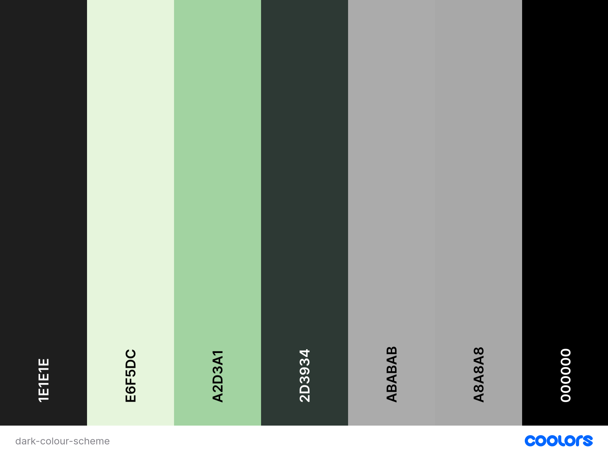

# WordWeaver
**WordWeaver** is an interactive, quiz-powered crossword game that blends wordplay with general knowledge. Designed with both entertainment and cognitive stimulation in mind, this web app dynamically builds crossword puzzles from quiz APIs, letting user test their knowledge while weaving answers across a responsive grid.

This project exists to:
  - Provide a unique and educational twist on traditional crossword puzzles.
  - Offer a dynamic, category-based quiz game experience that adapts to user preferences.
  - Explore creative, interactive frontend development using HTML, CSS, JavaScript, and third-party APIs.

**Target Audience**:
  - Quiz enthusiasts who enjoy trivia-style challenges.
  - Puzzle lovers looking for a new way to engage with crosswords.
  - Users of all ages who want a fun and educational browser-based game.

By combining trivia with crosswords, WordWeaver engages users in a mentally challenging experience that is equally suited for casual entertainment and light learning.

<!-- TODO: Insert final mockup screenshot here -->

## Table of Contents
- [User Goals](#user-goals)
- [User Stories](#user-stories)
- [Website Goals and Objectives](#website-goals-and-objectives)
- [Wireframes](#wireframes)
- [Design Choices](#design-chioces)
  - [Typography](#typography)
  - [Colour Scheme](#colour-scheme)
  - [Images](#images)
  - [Responsiveness](#responsiveness)
- [Features](#features)
  - [Existing Features](#existing-features)
  - [Future Enhancements](#future-enhancements)
  - [Stretch Goals](#stretch-goals)
- [Technologies Used](#technologies-used)
  - [Languages](#languages)
  - [Libraries and Frameworks](#libraries-and-frameworks)
  - [Tools](#tools)
  - [Image and Asset Tools](#image-and-asset-tools)
  - [API](#api)
  - [Validation and Accessibilty Testing](#validation-and-accessibilty-testing)
  - [Responsive Design Testing](#responsive-design-testing)
  - [Deployment](#deployment)
- [Testing](#testing)
  - [Bugs Fixed](#bugs-fixed)
  - [Responsiveness Tests](#responsiveness-tests)
  - [Code Validation](#code-validation)
    - [HTML](#html)
    - [CSS](#css)
    - [JavaScript](#javascript)
  - [User Story Testing](#user-story-testing)
  - [Feature Testing](#feature-testing)
  - [Accessibility Testing](#accessibility-testing)
  - [Lighthouse Testing](#lighthouse-testing)
  - [Browser Testing](#browser-testing)
- [Deployment](#deployment)
  - [To Delploy the Project](#to-delploy-the-project)
  - [To Fork the Project](#to-fork-the-project)
  - [To Clone the project](#to-clone-the-project)
- [Credits](#credits)

## User Goals
The following goals were identified to ensure WordWeaver offers meaningful value to its users:

  - Choose *categories* that match their interests or knowledge areas.
  - Solve fun and challenging crossword puzzles.
  - Engage with trivia-based questions across varying levels of difficulty.
  - Test and expand their general knowledge.
  - Access puzzles without needing to sign up or log in.
  - Experience smooth gameplay with intuitive navigation.
  - Enjoy a visually clean and responsive interface across devices.

## User Stories
- As a user, I want to choose the category of questions so that the crossword reflects my interests.
- As a user, I want to select the puzzle difficulty so I can play at my level.
- As a user, I want to play without needing to sign up or log in.
- As a user, I want to see clues displayed beside or beneath the crossword puzzle so I know how to solve it.
- As a user, I want to be able to input letters into the crossword grid so I can solve the puzzle.
- As a user, I the puzzle grid to adapt t the length of the answers so that every quiz feels custom-built.
- As a user, I want to be notified when I've correctly completed the puzzle so I know I've solved it.

User stories and development tasks are fully detailed on the [GitHub Project Board](https://github.com/users/creatvie-introvert/projects/13/views/1), showcasing steps taken to bring the project to completion.

## Website Goals and Objectives
The primary goal of **WordWeaver** was to create an engaging and accessible crossword puzzle web app that combined quiz-style clues with an interactive grid. The project was designed to provide both entertainment and educational value, while demonstrating strong frontend development skills, user-centred design and API integration.

**Key Objectives**
- Deliver an intuitive puzzle solving experience.
- Support a range of player abilities.
- Integrate quiz-style clues.
- Ensure full responsiveness.
- Encourage replay-ability and engagement.
- Fetch data from a public API.
- Showcase professional development skills.

## Wireframes
**WordWeaver** is a responsive, single-page web app that blends trivia with classic crossword puzzles. Designed to be clean, intuitive, and mobile-first, the app allows users to create dynamic puzzles by selecting a difficulty level and a quiz category, all without needing to sign-up or log in.

Clues are fetched in real-time from a public trivia API and mapped into a crossword-style grid that users can interact with directly. The design encourages a frictionless experience as players can jump straight into a game, switch between light and dark modes, and recieve instant feedback upon completion.

From a UX perspective, WordWeaver prioritises clarity and choice. Its modular layout adapts responsively across mobile, tablet, and desktop, whilst maintaining a minimalist aesthetic. This ensures the puzzle remains the focal point. Built with accessibility and usability in mind, this project demonstrates dynamic DOM manipulation, API integration, and progressive interaction - all shaped through thoughtful wireframing and iteration in Figma.

Mobile Wireframes

Tablet Wireframes

Desktop Wireframes

## Design Choices
The design of WordWeaver was shaped by both user needs and accessibility principles, aiming for a visually engaging yet highly functional experience. Every design decision, from typography and colour contrast to responsiveness, was made to support ease of use, cross-device compatibility, and inclusive gameplay. This section outlines the key design systems used throughout the project, including font hierarchy, dual-theme colour palettes, minimal imagery, and mobile-first design.

### Typography
WordWeaver uses the **Poppins** typeface, a geometric sans-serif font chosen for its clean, modern appearance and excellent readability across devices. With a rounded yet structured aesthetic, Poppins helps strike a balance between playfulness and clarity - ideal for a puzzle based game.

The type system follows a responsive scale that adjusts font sizes across mobile, tablet, and desktop devices to enhance usability and maintain visual hierarchy.

|Text Style|Mobile|Tablet|Desktop|
|----------|------|------|-------|
|Page-Heading/Hero|40px|48px|64px|
|Section Heading|32px|40px|48px|
|Subheading|20px|24px|32px|
|Paragraph/Body|16px|18px|20px|
|Button/Label|18px|20px|22px|
|Caption/Tag|14px|14px|14px|

### Colour Scheme
To support both aesthetic appeal and accessibility, WordWeaver is designed with two themes: **light mode** and **dark mode**. Each theme draws directly from the brand's nature inspired palette and maintains contrast ratios that align with WCAG 2.1 AA guidelines.

**Light Theme**

The light theme uses a soft **seasalt background** paired with **charcoal text** and button elements.Rich natural greens are used for accents, hover states, and focus rings - echoing the organic tones of the WordWeaver logo. These choices ensure clarity, calmness, and consistent branding.

**Dark Theme**

The dark theme features a deep charcoal background paired with light neutral tones for text and interface contrast. a muted lavender-blue provides visual focus without causing strain. This palette was selected to reduce glare and improve readability in low-light environments while maintaining a professional, modern tone.

### Images
The project's visuals were kept clean and purposeful to support usability and accessibility. The only raster image used was the custom WordWeaver logo, which was designed to reflect the game's whimsical and intellectual nature. The logo features a feather quill, sparkles, and stylised crossword tiles to subtly reinforce the game's word puzzle theme.

All functional icons (such as Help, Info, and Theme Toggle) were implemented using inlive SVGs to maintain visual sharpness and scalability across all screen sizes. SVGs were chosen for their accessibility benefits and performance efficiency, ensuring consistent styling and fast loading without relying on external icon libraries.

Together, the imagery reinforced the brand's playful yet focused tone while maintaining a minimal and distraction-free interface.

### Responsiveness
WordWeaver was designed and developed with a mobile-first approach to ensure usability across a range of devices. The layout and interface dynamically adapts to diffferent screen sizes and orientations, providing an optimal experience on smartphones, tablets, and desktop browsers.

During development, responsive behaviour was implemented using CSS media queries and flexible layout techniques. Key interface elements such as buttons, grid sizes, and typography scaled appropriately based on the user's viewport, and modals adjusted to remain legible and centred.

The table below outlines the breakpoints that were used throughout the project to guide layout and design decisions:

|Breakpoint|Device Type|Min Width|Max Width|
|----------|-----------|---------|---------|
|Extra Small|Smartphones|320px|479px|
|Small|Small Tablets|480px|767px|
|Medium|Tablets|787px|1023px|
|Large|Laptops & Desktops|1024px|∞|

Responsiveness was tested as each new screen size was added to ensure both visual consistency and functionality. Scrollable content was handled carefully, touch targets were spaced for accessibility on small screens, and key game features remained centred and visible regardless of resolution.

## Features

### Existing Features

### Future Enhancements

### Stretch Goals

## Technologies Used
This project was built using core frontend technologies along with a range of design, testing, and optimisation tools. The goal was to ensure clean code, responsive layouts, and an accessible user experience.

### Languages
- **[HTML](https://developer.mozilla.org/en-US/docs/Glossary/HTML5)** - for semantic structure of the page
- **[CSS](https://developer.mozilla.org/en-US/docs/Web/CSS)** - for styling, responsive layout, and theme switching
-**[JavaScript](https://developer.mozilla.org/en-US/docs/Web/JavaScript)** - for dynamic functionality, DOM interaction, and API integration

### Libraries and Frameworks
- **[Google Font *Poppins*](https://fonts.google.com/specimen/Poppins)** - clean and modern typeface used throughout the site
- **[FontAwesome](https://fontawesome.com)** - for scable and accessible SVG icons
- **[AOS (Animate on Scroll)](https://michalsnik.github.io/aos/)** - for simple scroll-triggered animations

### Tools
- **[Figma](https://www.figma.com/)** - used to create wireframes for mobile, tablet and desktop views
- **[Visual Studio Code](https://code.visualstudio.com/)** - code editor used for the entire development process
- **[Git](https://git-scm.com)** - version control system
- **[GitHub](https://github.com)** - for repository hosting and project board tracking
  - **[GitHub Project Board](https://github.com/users/creatvie-introvert/projects/13/views/1)** - tracks issues, user stories, and development tasks
- **[Google Chrome DevTools](https://developer.chrome.com/docs/devtools/)** - used extensively for debugging, performance testing, and responsive inspection

### Image and Asset Tools
- **[Sora](https://sora.ai/)** - Al tool used to generate the WordWeaver logo
- **[Squoosh](https://squoosh.app/)** - image optimisation tool for reducing file size while preserving quality
- **[Coolors](https://coolors.co/)** - used to define and refine the colour palette for both themes

### API
- **[Opentrivia DB](https://opentdb.com/)** - public trivia API used to fetch quiz-style clues dynamically based on user-selected categories and diffficulty

### Validation and Accessibilty Testing
- **[WAVE Web Accessibility Evaluation Tool](https://wave.webaim.org/)** - used to check for accessibilty issues
- **[WebAim Contrast Checker](https://webaim.org/resources/contrastchecker/)** - verified colour contrast compliance (WCAD 2.1 AA/AAA)
- **[W3C Markup Validator](https://validator.w3.org/)** - for validating HTML structure
- **[W3C CSS Validator](https://jigsaw.w3.org/css-validator/)** - for validating stylesheet syntax
- **[Autoprefixer](https://autoprefixer.github.io/)** - ensured browser compatibility for custom CSS
- **[JSHinterface](https://creatvie-introvert.github.io/JSHinterface/)** - used to validate and lint JavaScript code during development

### Responsive Design Testing
- **[Am I Responsive?](https://ui.dev/amiresponsive/)** - for generating device mockups of the responsive design
- **[Responsive Design Checker](https://responsivedesignchecker.com/)** - used to preview layouts across various devices and resolutions

### Deployment
- **[GitHub Pages](https://pages.github.com)** - used for live deployment of the project

## Testing

### Bugs Fixed

### Responsiveness Tests

### Code Validation

#### HTML

#### CSS

#### JavaScript

### User Story Testing

### Feature Testing

### Accessibility Testing

### Lighthouse Testing

### Browser Testing

## Deployment
The project was deployed using **GitHub Pages** and is publicly accessible via the following link:

[WordWeaver](https://creatvie-introvert.github.io/wordweaver/)

### To Delploy the Project
1. Log in to your GitHub account and navigate to the project repository.
2. Click on the **Settings** tab.
3. In the left sidebar, scroll to **Pages**.
4. Under **Source**, select the main branch and /root directory.
5. Click **Save**. GitHub pages will automatically build and deploy the site.
6. After a few moments, the live link will appear at the top of the GitHub Pages section.

### To Fork the Project
1. Visit the [WordWeaver repository](https://github.com/creatvie-introvert/wordweaver).
2. In the top-right corner of the page, click the **Fork** button.
3. Choose the GitHub account where the forked repository will be copied.
4. You now have your own version of the project to edit freely.

### To Clone the project
1. Navigate to your preferred local directory.
2. Open your terminal or command line interface.
3. Type the following command:
<pre>
bash
git clone https://github.com/creatvie-introvert/wordweaver.git
</pre>
4. Press **Enter** to clone the repository to your local machine.
5. Open the folder in your code editor (e.g. VS Code) to begin exploring or editing the files.

## Credits
- **CSS Reset**: Based on [Josh W. Comeau's Custom CSS Reset](https://www.joshwcomeau.com/css/custom-css-reset/)